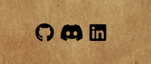

# Mythic GM 

## Table of contents
- <a href="#about">About Mythic</a> 
- <a href="#ux">UX Design</a>
- <a href="#features">Features</a>
  - <a href="#general-features">General Features</a>
  - <a href="#background">Background</a>
  - <a href="#logo">Logo</a>
  - <a href="#how-to">How to Modal</a>
  - <a href="#emulator">Emulator</a>
  - <a href="#oracle">Oracle</a>
  - <a href="#journal">Journal</a>
  - <a href="#lists">Lists</a>
  - <a href="#footer">Footer</a>
- <a href="#features-left">Features Left to Impliment</a>
- <a href="#wireframes">Wireframes</a>
- <a href="#tech">Technologies Used</a>
- <a href="#test">Testing</a>
- <a href="#deployment">Deployment</a>
- <a href="#credits">Credits</a>

<section id="about">

  Mythic GM is a digital implementation of the <a href="https://www.drivethrurpg.com/product/20798/Mythic-Game-Master-Emulator" target="_blank">Mythic Game Master Emulator</a>. It is a tool for tabletop role-playing games like Dungeons & Dragons and Call of Cthulhu.
  
  Role-Playing Games are collaborative storytelling games played with pen and paper. They take place in the players' collective imagination and use dice to randomly determine the outcome of player choices in the story. 

  Mythic is a tool that can assist in the storytelling aspects of the game, generate random events, and answer yes/no questions the players may have about the world they are exploring. 

  There are two groups in any role-playing game, the players who each control one character, and the Game Master, or GM, who is responsible for describing the world, generating obstacles for the players to overcome, and controlling all of the nonplayable characters the players may interact with. 

  Mythic is primarily for three groups of people:

  - The GM - Mythic allows a GM to run a game without the need for the lengthy preparation usually involved. Mythic games are largely improvised with maybe a few minutes of initial brainstorming for the setup.

  - The players - If there is no GM available or the player count is too small, the players can use Mythic to generate the adventure without the GM. Mythic is commonly used to play RPG solo with one player.

  - Creative Writers - The mechanics in Mythic lend themselves very well to any creative writer who may have writer's block, or just want some random ideas for a story. 

  The site is deployed here:
  - https://xiaoniuniu89.github.io/mythic_gm/

   
  
   
   
</section>

<section id="ux">

# UX Design

There were so many features I wanted to implement in this app, but due to time constraints and my own limitations in making apps, I focused on the MVP as the first release. The features for this release will focus entirely on the sourcebook. I will not add any additional features.  

 

In my research, I found a couple of apps that do the same thing as my app, but they are visually, extremely lackluster. I wanted to make my app thematic. It should feel as if it is part of the game. I was very careful in every step of making the app to make sure it was as immersive as possible.

The layout is very simple. I wanted to experiment with tabs for this app, so I made the app all on one page. This means less time wasted trying to load pages and trying to find information. 

</section>

<section id="features">

  # Features
  ## General Features 

  ### Fonts
  - <a href="https://fonts.google.com/specimen/Cinzel+Decorative?query=cinze">Cinzel Decorative</a> - Thematic font for Logo and any other headings and buttons.
  - <a href="https://fonts.google.com/specimen/Raleway?query=ralewa">Raleway</a> - text compliments Cinzel very well. Used mostly for About section.
  - <a href="https://fonts.google.com/specimen/Eater?query=Eater">Eater</a> - Any text generated in the oracle uses this text. I wanted the feeling that the answers were coming from another realm or a magic mirror - something like that.

  ### Color 
  Color is kept mostly black and white except for the background image which I think has a kind of pirate map/adventure map coffee stain to it. 
  The main colors are:
  - Black - Emulator Window
  - Whitesmoke - text. I wanted to have a bone-white kind of color to any text in the emulator. As if the user was casting old runes.
  - #e9e9e9 - how to section background-color
  - Background image has a stained coffee kind of color to it.

  ## Background Image 

  

  The background image is perfect for this app. It is reminiscent of an old map and will be very thematic to most RPG games. It is a nice contrast to the overall black and white colors present elsewhere.

  ## Logo 

  

  The logo text was a very important consideration, because I wanted the text to look somewhat like the logo of the <a href="https://www.wordmillgames.com/mythic-rpg.html"> source book</a>.

  ## How to section 

  ### Button
  

  ### Modal
  

  All of the text explaining how to use the app is found in a modal window that the user can open without going to a new page. 

  It will darken the background to create contrast with the app and it has its own unique scrollbar which I feel will not distract from the aesthetics of the app.

  This gave me a lot of freedom to write as much content as I wanted for the how-to-use section without cluttering up the site and affecting the user experience. The app can be quite complicated to use, so I am very pleased with the how-to section and how in-depth it went with explaining everything and giving examples of use. 

  ## Emulator 

  

  ### Tabs

  <image src="assets/images/tabs.png">

  The three tabs each display different content. The active tab is also a brighter color to remind users where they are. 

  ## Oracle Tab 

  ### Chaos Number

  

  The chaos number starts at 5. It can go as low as 1 and as high as 9. The chaos number represents how in control the players are of the adventure. When it reaches level 9 a color animation will make the chaos number flash a blood red to highlight how out of control the players are of the adventure. 

  ### Fate Buttons

  

  The three buttons at the bottom of the oracle tab are the main ways users interact with mythic. 

  The start scene button is used whenever the user starts a new scene/chapter. The higher the chaos number the higher the chance of something random happening at the start of a scene. 

 The question button lets users ask Mythic yes/no questions. When clicked users are prompted to select the odds of their question being yes. The higher the chaos number, the higher the chance the question will be yes. There is also the possibility of a random event happening here. 

 The event button generates two random keywords that the user will interpret to give direction to the story or to flesh out a yes/no answer.

 

 When an answer is displayed - the emulator window will display a blur effect animation with the text in the center of the window. 

## Journal Tab 

 </section>

 The journal tab is a place the user can chronicle their adventure. 

users can add a scene box. It has space for a title and for the body of the scene text also. It is scrollable so a user can make it as short or long as desired. 

## Lists Tab 

 

 The lists tab is a place to keep track of any non-playable characters/groups and 
threads(plot points) that are relevant to the adventure.

 

 The input from both lists will be stored in an array that the oracle will randomly select from in some cases of random events. If they are empty nothing will be selected. 

## Footer 

 

 The footer is extremely simple. It has links to some social media sites about me. 

 </section>
 
 # Features to Impliment 

 ### NPC Generator 
 A feature to generate non-playable characters with names and backstories. This is so the user will not have to pause the game and think of one by themselves. 

 ### Encounter Generator 
 A feature to generate encounters for the players. This would be an extension of the random event and event button. Ideally, encounters should be fleshed out more so the players do not need to interpret an answer.

 ### Scene/Mission Generator 
 A feature to auto-generate the scene action for the players so they have a goal without the need for planning.

 ### Monster Stats 
 This would involve a database of monsters and their stats from some of the more popular RPG systems like dungeons and dragons and pathfinder. 

### Music 
Music and background sounds - A simple music player to provide more atmosphere. 

### 3D dice 
This would be useful for players who want to play but don't have access to dice

### Mythic Variations 1 & 2 
There are another 2 books in the Mythic GM series that provide more options to players for using mythic. It would be great to implement them into this app. 

# Wireframes 

Wireframes for the app 
- <a href="assets/wireframes/desktop-tablet.pdf">Desktop & Tablet View</a>
- <a href="assets/wireframes/phone.pdf">Phone View</a>

# User Stories 

- As a GM/player, I want to supplement my game with mythic without the need for flipping through pages to find information.

- As a GM/player, I want to use mythic without all of the usually involved bookkeeping.

- As a player, I want a GM tool that can replace my group’s GM if they can not arrive at a session.

- As a GM/player, I want the app to track all of my characters, plots, and threads. I do not want the immersion of the game stifled by having to think too much about what is happening to the
story.

- As a GM/player, I want any unnecessary dice rolls to be handled by the app. I should only be focused on my own character’s dice rolls.

- As a Gm, I want my players to feel as if the story is unfolding naturally and not feel like I am pushing them towards one conclusion where their choices do not matter. 

- As a GM/player, I want a clean, elegant app that is not cluttered with text. Anything to take me out of the immersive story is bad.

All user's needs should be met by this app. Everything they need is on one page. If they forget anything the how to use modal window is just one click away. 

There are no extra dice rolls for players, and they can play a session by themselves if their GM can not make it. 

All characters and plot threads are tracked and referenced when needed by the app. There is no extra book-keeping involved. 

There is plenty of random chance at work with mythic and yet the story should feel organic to the point that the players' choices are shaping the world around them. 

All of the text that could clutter the app is contained in a modal window with its own navigatable table of contents. The app is clutter-free and is a true representation of the source material.

# Technologies Used 

[Gitpod](https://www.gitpod.io) 
- IDE (Intigrated Development Environment)

[Github](https://www.github.com)
- remote repository hosting platform

[HTML](https://developer.mozilla.org/en-US/docs/Web/HTML) & [CSS](https://developer.mozilla.org/en-US/docs/Web/CSS) & [JavaScript](https://developer.mozilla.org/en-US/docs/Web/JavaScript)

- Languages Used to make the site

[Chrome Dev Tools](https://developer.chrome.com/docs/devtools/)
- Used to check site responsiveness

[Jigsaw](https://jigsaw.w3.org/css-validator/)
- Check for CSS errors

[HTML Validator](https://validator.w3.org/)
- Check for HTML errors

[jshint](https://jshint.com/)
- check for JavaScript errors

[Youtube](https://www.youtube.com)
- Videos embedded from here

[I love images](https://www.iloveimg.com/crop-image)
- To resize and crop photos

[Font Awesome](https://fontawesome.com/)
- for Icons inboxes and footer

[Balsamiq](https://balsamiq.com/)
- to make wireframes

# Testing 

Testing can be found in this file: [Testing](TESTING.md)

 

# Deployment 

The site is deployed on git hub pages. The link is here:

https://xiaoniuniu89.github.io/mythic_gm/

The steps I used to deploy the site:
- Go to [github.com](https://www.github.com)
- Log in to account
- Click repositories
- Click mythic_gm
- Click settings
- scroll to the pages section at the bottom 
- under source heading click select main
- The page will refresh with a blue background message that says the page is deployed and provide a link. If the message reads ready to be deployed, wait a few minutes and refresh the page. 

How to run the code from the site 
- Go to [github.com](https://www.github.com)
- Log in to account
- Click repositories
- Click mythic_gm
- Click the green code button that says Clone or download 
- Click Download ZIP
- Open IDE [replit](https://replit.com/~)
- upload folder/files

How to clone the repository
- Go to [github.com](https://www.github.com)
- Log in to account
- Click repositories
- Click mythic_gm
- Click the green code button that says Clone or download 
- copy URL link 
- open or create a repo 
- go to terminal and type git clone and paste the link

# Credits 

## Content

### Text
- The Mythic GM system rules, all text displayed in the display box in the oracle tab of the emulator, the description of Mythic, tabletop roleplaying games, and the glossary in the how-to section modal window were all written by [Tana Pigeon](https://www.patreon.com/wordmillgames) of [Word Mill Games](https://www.wordmillgames.com/) for her book [Mythic Game Master Emulator](https://www.drivethrurpg.com/product/16173/Mythic-Role-Playing?it=1). Descriptions in the how-to section were edited somewhat by me so as to make sense in relation to the app, or in an attempt to condense some explanations. 
- all other text was by me 

### Media

#### Images
- Background Image   https://www.pexels.com/photo/empty-brown-canvas-235985/

#### Videos
- All videos hosted on [youtube](www.youtube.com)
  - Mythic in use - [Me Myself & Die](https://www.youtube.com/channel/UCtiBzkVoYrugJkrpW7_75Ag)
  - Dungeons & Dragons explained - [Vox](https://www.youtube.com/channel/UCLXo7UDZvByw2ixzpQCufnA)

### Code

The tutorials I used are as follows: 

- Modals - https://www.w3schools.com/howto/howto_css_modals.asp
- Text blur animation
  - https://css-tricks.com/fun-with-blurred-text/
  - https://codepen.io/onge/pen/KwdZpE
- Slider (for the set odds feature) - https://www.w3schools.com/howto/howto_js_quotes_slideshow.asp
- To do list (Lists tab content) - https://www.w3schools.com/howto/howto_js_todolist.asp
- Scrollbar - https://www.w3schools.com/howto/howto_css_custom_scrollbar.asp

# Aknowledgements
- My mentor Precious who put up with me trying to explain this incredibly nerdy app. 

- Tana Pigeon for creating Mythic.

- CC, Fiach & Eoin for playtesting.
 

