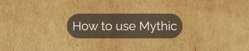

# Mythic GM 

## Table of contents
- <a href="#about">About Mythic</a> 
- <a href="#ux">UX Design</a>
- <a href="#features">Features</a>

<section id="about">

  Mythic GM is a digital implimentation of the <a src="https://www.drivethrurpg.com/product/20798/Mythic-Game-Master-Emulator" target="_blank">Mythic Game Master Emulator</a>. It is a tool for table top role playing games like Dungeons & Dragons and Call of Cthulhu.
  
  Role Playing games are collaborative story telling games played with pen and paper. They take place in the players's collective imagination and use dice to randomly determine the outcome of player choices in the story. 

  Mythic is a tool that can assist in the story telling aspects of the game, generate random events and answer yes/no questions the players may have about the world they are exploring. 

  There are two groups in any role playing game, the players who each control one character, and the Game Master, or GM, who is responsible for describing the world, generating obstacles for the players to overcome and controlling all of the non playable characters the players may interact with. 

  Mythic is primarily for three groups of people:

  - The GM - Mythic allows a GM to run a game without the need for the lengthy preperation usually involved. Mythic games are largely improvised with maybe a few minutes initial brainstorming for the setup.

  - The players - If there is no GM available or the player count is too small, the players can use Mythic to generate the adventure without the GM. Mythic is commonly used to play rpg solo with one player.

  - Creative Writers - The mechanics in Mythic lend themselves very well to any creative writer who may have writers block, or just want some random ideas for a story. 

  The site is deployed here:
  - https://xiaoniuniu89.github.io/mythic_gm/

   
  
   
   
</section>

<section id="ux">

# UX Design

There were so many features I wanted to impliment in this app, but due to time constraints and my own limitations in making apps, I focused on the MVP as the first release. The features for this release will focus entirely on the sourcebook. I will not add any additional features.  

 

In my research I found a couple of apps that do the same thing as my app, but they are visually, extremely lackluster. I wanted to make my app thematic. It should feel as if it is part of the game. I was very careful in every step of making the app to make sure it was as immersive as possible.

The layout it very simple. I wanted to experiment with tabs for this app, so I made the app all on one page. This means less time wasted trying to load pages and trying to find information. 

</section>

<section id="features">

# Features
## General Features
### Fonts
- <a href="https://fonts.google.com/specimen/Cinzel+Decorative?query=cinze">Cinzel Decorative</a> - Thematic font for Logo and any other headings and buttons.
- <a href="https://fonts.google.com/specimen/Raleway?query=ralewa">Raleway</a> - text compliments Cinzel very well. Used mostly for About section.
- <a href="https://fonts.google.com/specimen/Eater?query=Eater">Eater</a> - Any text generated in the oracle uses this text. I wanted the feeling that the answers were coming from another realm or a magic mirror - something like that.

### Color 
Color are kept mostly black and white except for the background image which I think has a kind of pirate map/adventure map coffee stain to it. 
The main colors are:
- Black - Emulator Window
- Whitesmoke - text. I wanted to have a bone white kind of color to any text in the emulator. As if the user was casting old runes.
- #e9e9e9 - how to section background color
- Background image has a stained coffee kind of color to it.

## Background Image 

The background image is perfect for this app. It is reminiscent of an old map whll be very thematic to most rpg games. It is a nice contrast to the overall black and white colors present elsewhere.

## Logo 

The logo text was a very important consideration, because I wanted the text to look somewhat like the logo of the <a href="https://www.wordmillgames.com/mythic-rpg.html"> source book</a>.

## How to section 

### Button

### Modal

All of the text explaining how to use the app is found in a modal window that the user can open without going to a new page. 

It will darken the background to create contrast with the app and it has its own unique scrollbar which I feel will not distract from the asthetics of the app.

This gave me a lot of freedom to write as much content as I wanted for the how to use section without cluttering up the site and effecting the user experience. The app can be quite complicated to use, so I am very pleased with the how to section and how in depth it went with explaining everything and giving examples of use. 

</section>

  Background Image 
  https://www.pexels.com/photo/empty-brown-canvas-235985/

  modal box 
  https://www.w3schools.com/howto/howto_css_modals.asp

