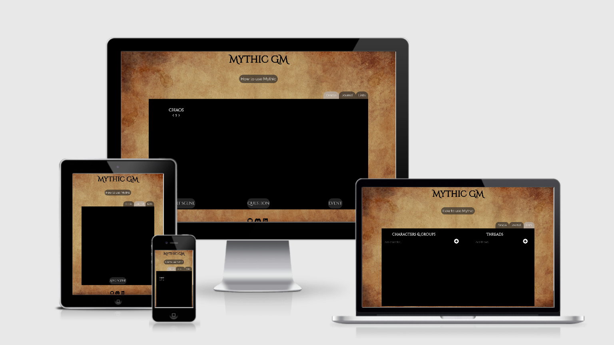

# Mythic GM 

## Table of contents
- <a src="#about">About Mythic</a> 
- <a src="#links">Links</a>

<section id="about">
  Mythic GM is a digital implimentation of the <a src="https://www.drivethrurpg.com/product/20798/Mythic-Game-Master-Emulator" target="_blank">Mythic Game Master Emulator</a>. It is a tool for table top role playing games like Dungeons & Dragons and Call of Cthulhu. 

  Role Playing games are collaborative story telling games played with pen and paper. They take place in the players's collective imagination and use dice to randomly determine the outcome of player choices in the story. 

  Mythic is a tool that can assist in the story telling aspects of the game, generate random events and answer yes/no questions the players may have about the world they are exploring. 

  There are two groups in any role playing game, the players who each control one character, and the Game Master, or GM, who is responsible for describing the world, generating obstacles for the payers to overcome and controlling all of the non playable characters the players may interact with. 

  Mythic is primarily for three groups of people:

  - The GM - Mythic allows a GM to run a game without the need for the lengthy preperation usually involved. Mythic games are largely improvised with maybe a few minutes initial brainstorming for the setup.

  - The players - If there is no GM available or the player count is too small, the players can use Mythic to generate the adventure without the GM. Mythic is commonly used to play rpg solo with one player.

  - Creative Writers - The mechanics in Mythic lend themselves very well to any creative writer who may have writers block, or just want some random ideas for a story. 

  The site is deployed here:
  - https://xiaoniuniu89.github.io/mythic_gm/

   
  https://xiaoniuniu89.github.io/mythic_gm/
  
</section>

<section id="links">

  Background Image 
  https://www.pexels.com/photo/empty-brown-canvas-235985/

  modal box 
  https://www.w3schools.com/howto/howto_css_modals.asp

</section>