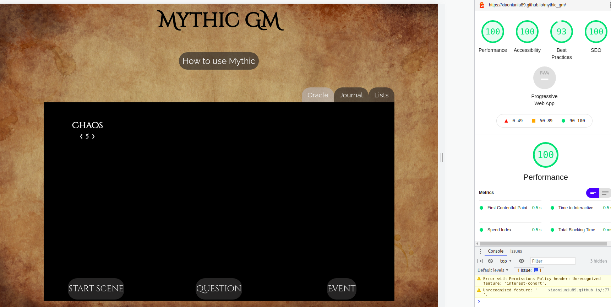
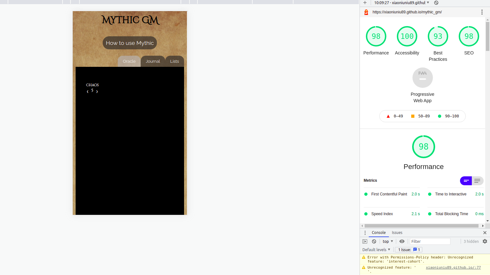
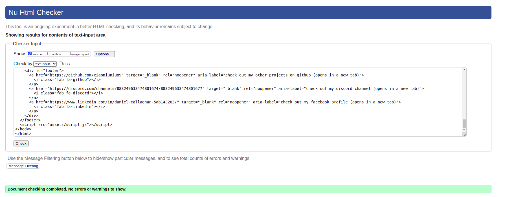
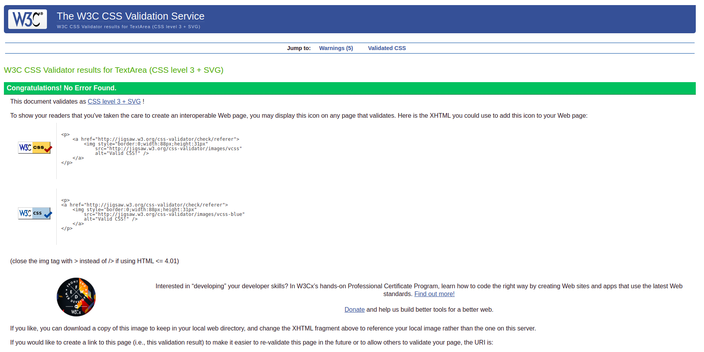
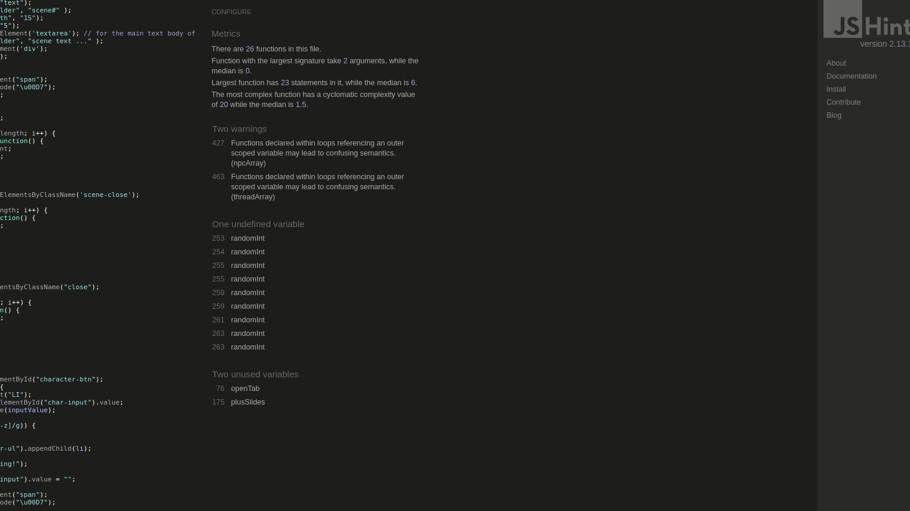
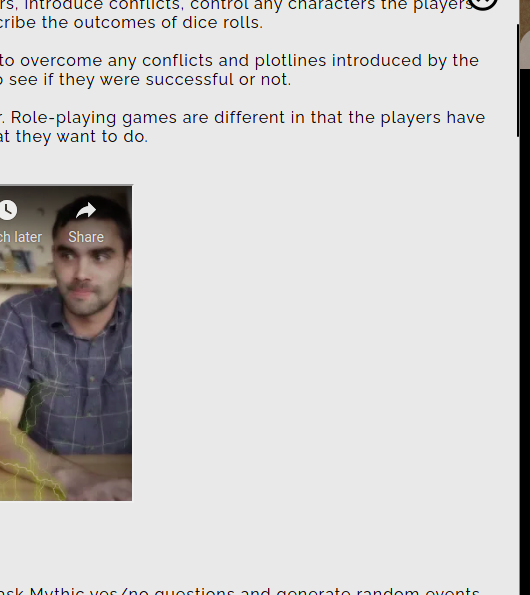
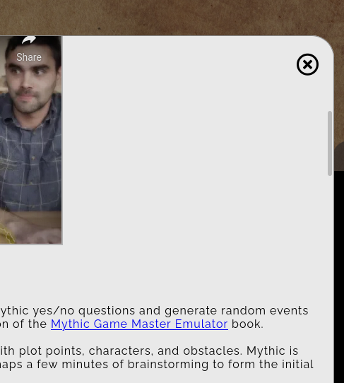
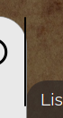
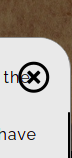

# Lighthouse Test 

Lighthouse test was very good. 

## Desktop

## Mobile

# Validator testing 

## HTML 

There were no errors found on HTML. 

## CSS

No errors on the W3C jigsaw validator

## JavaScript 

no errors on jshint

# Testing User Stories 

As a GM/player, I want to supplement my game with mythic without the need for flipping through pages to find information.
- The user forgets a rule. Click how to modal. Use table of contents to quickly navigate to desired location.  
- The app tells the user a character or thread is involved in the next action. The app selects this automatically. No extra effort from the user whatsoever. 

As a GM/player, I want to use mythic without all of the usually involved bookkeeping.
- The user wants to delete a scene or list. The user clicks the "x" button and the list or scene is automatically updated. 
- If a value from a list is referenced, the app willl automatically select a value and return it to the user. There is no need to check and choose manually. 

As a player, I want a GM tool that can replace my group’s GM if they can not arrive at a session.
- The player can use Mythic as a GM and play an adventure without preparing anything. Scene button will check if anything random happens. 
- The question button will answer any yes/no questions the player has about the environment/situation. 
- The event button will give the player ideas as to the plot of the story.

As a GM/player, I want the app to track all of my characters, plots, and threads. I do not want the immersion of the game stifled by having to think too much about what is happening to the story.
- All characters and threads are stored in the list tab. 
- Anytime a character/group/thread is referenced by the oracle, the app will automatically isert this value into a random event for the user.

As a GM/player, I want any unnecessary dice rolls to be handled by the app. I should only be focused on my own character’s dice rolls.
- The scene, question and event button and the app automatically selecting characters or threads elliminate any extra dice rolls by the player or GM. 

As a Gm, I want my players to feel as if the story is unfolding naturally and not something I have pre-ordained. This is to give them the feeling that they are truly interacting with plot twists rather than feeling like I am pushing them down one linear path.
As a GM/player/group, I want the option of immersive music in the background.
- The player ask a question. The GM answers it by using the question button. It is a random answer based only on the odds. 
- The GM says something unexpected occurs. The app automatically generates a focus for the random event, the event button will provide a cue as to what has happened. It is random and not likely to be the result of a predetermined story line. 

As a GM/player, I want a clean elegant app that is not cluttered with text. Anything to take me out of the immersive story is bad.
- Any text that is not relevant to the funciton of the app is in the how to modal window. 

# Responsive Testing 

The app is fully responsive. I wanted to experiment more with vh and vw measurments in this app. The desktop and tablet view are both the same. 

Media queries mainly deal with making text smaller and making the viewport height larger for mobile. 

### How to use section 
This is fully responsive - the only difference is that the iframes will change size at 870 px to 80% of the modal window. 

### Oracle tab

The buttons and chaos number will get smaller as the screen width is lowered, but overall there is no drastic change except for the emulator window becoming longer for mobile view. Button and font size for the button will get smaller in relation to sreen width also.

### Journal Tab

The journal tab contents start 3 divs per row but will change to block elements with 1 per row at smaller screen width. Button size and font size will also get smaller.

### Lists Tab
The lists tab content, characters and threads, start as flex items taking roughly 70% and 30% respectivly of the emulator window but will change to being block elements stacked at smaller screen width.

## Video of Responsivness Testing 

https://www.youtube.com/watch?v=JIy4kP-j44E

# Browser Compatibility 

The app was tested on the following browsers:

- [Google Chrome](https://www.google.com/chrome/?brand=FHFK&gclid=CjwKCAjw092IBhAwEiwAxR1lRnrDJkW2rc2m-_DsqG2ISAAChH0tbKgopfm-3BMuide3ikPssZgvWhoCsVUQAvD_BwE&gclsrc=aw.ds)

- [Firefox](https://www.mozilla.org/en-US/firefox/) 

- [Opera](www.opera.com) 

- [Edge](https://www.microsoft.com/en-us/edge) 

- [Safari](https://www.apple.com/uk/safari/)

The site looks great on all browsers and I could find two main issues. 

- minor issue - The color is slightly more grey and less vibrant on edge and firefox. 
- major issue - There is a huge difference in how the scroll bars render in some browsers. 

### How to use section scrollbar
In Google Chrome, safari, opera and edge there is little to no deifference in how it is rendered. It is a thin black line. In firefox it is rendered as a grey line, sligthly fatter with less opacity. 

Chrome 

Firefox 

### Journal Tab 

Chrome Render the scrollbar outside the emulator window with no black background. 

Firefox does not render the scrollbar or it is hidden by the emulator black background. Although you can still scroll. 

Edge and Safari have no background and the scroll bar is half on the emulator window and half outside. 

Opera renders outside the emulator window with a black background. 

### Lists tab 

Chrome and safari render with no background outside the emulator window. 

Firefox again does not render due to black background but is fully functional. 

edge and safari 

Edge and Safari have no background and the scroll bar is half on the emulator window and half outside. 

# Bugs 

When the blur animation is finished, depending on the browser it can be highlighted and displayed again that way. 

The scroll bar sticks out slightly due to the border radius on the modal window. 

The close button in the modal window sometimes obscures text a little. 

Firefox scroll not rendering on black background.