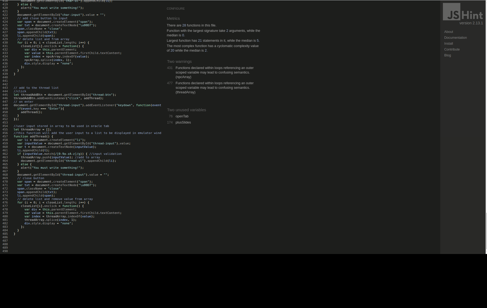

# Lighthouse Test 

Lighthouse test was very good. 

## Desktop

## Mobile

# Validator testing 

## HTML 

There were no errors found on HTML. 

## CSS

No errors on the W3C jigsaw validator

## JavaScript 

no errors on jshint

# Testing User Stories 

As a GM/player, I want to supplement my game with mythic without the need for flipping through pages to find information.
- The user forgets a rule. Click how to modal. Use table of contents to quickly navigate to desired location.  
- The app tells the user a character or thread is involved in the next action. The app selects this automatically. No extra effort from the user whatsoever. 

As a GM/player, I want to use mythic without all of the usually involved bookkeeping.
- The user wants to delete a scene or list. The user clicks the "x" button and the list or scene is automatically updated. 
- If a value from a list is referenced, the app willl automatically select a value and return it to the user. There is no need to check and choose manually. 

As a player, I want a GM tool that can replace my group’s GM if they can not arrive at a session.
- The player can use Mythic as a GM and play an adventure without preparing anything. Scene button will check if anything random happens. 
- The question button will answer any yes/no questions the player has about the environment/situation. 
- The event button will give the player ideas as to the plot of the story.

As a GM/player, I want the app to track all of my characters, plots, and threads. I do not want the immersion of the game stifled by having to think too much about what is happening to the story.
- All characters and threads are stored in the list tab. 
- Anytime a character/group/thread is referenced by the oracle, the app will automatically isert this value into a random event for the user.

As a GM/player, I want any unnecessary dice rolls to be handled by the app. I should only be focused on my own character’s dice rolls.
- The scene, question and event button and the app automatically selecting characters or threads elliminate any extra dice rolls by the player or GM. 

As a Gm, I want my players to feel as if the story is unfolding naturally and not something I have pre-ordained. This is to give them the feeling that they are truly interacting with plot twists rather than feeling like I am pushing them down one linear path.
As a GM/player/group, I want the option of immersive music in the background.
- The player ask a question. The GM answers it by using the question button. It is a random answer based only on the odds. 
- The GM says something unexpected occurs. The app automatically generates a focus for the random event, the event button will provide a cue as to what has happened. It is random and not likely to be the result of a predetermined story line. 

As a GM/player, I want a clean elegant app that is not cluttered with text. Anything to take me out of the immersive story is bad.
- Any text that is not relevant to the funciton of the app is in the how to modal window. 